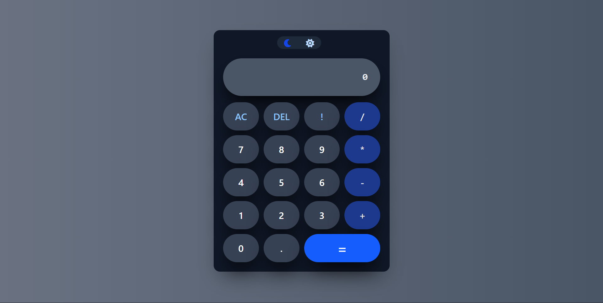

# 🧮 React Calculator with Dark Mode & Factorial Support

A responsive, keyboard-enabled calculator built with **React**, styled using **Tailwind CSS**, and powered by **mathjs** for safe expression evaluation. It features dark/light mode toggling, keyboard input support, and includes.

---

## ✨ Features

- 🎨 **Light/Dark mode toggle**
- ⌨️ **Full keyboard input support**
- 🧠 **Smart expression evaluation** using `mathjs`
- 📱 **Responsive layout** (desktop and mobile friendly)
- ⚡ Built with **React + Tailwind CSS**

---

## 🚀 Preview

| Light Mode |

| Dark Mode |



---

## 📦 Installation

Clone the repository and install dependencies:

```bash
git clone https://github.com/iamrahul-07/Calculator.git
cd react-calculator
npm install
